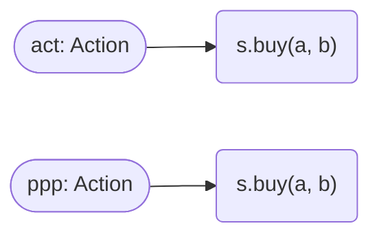
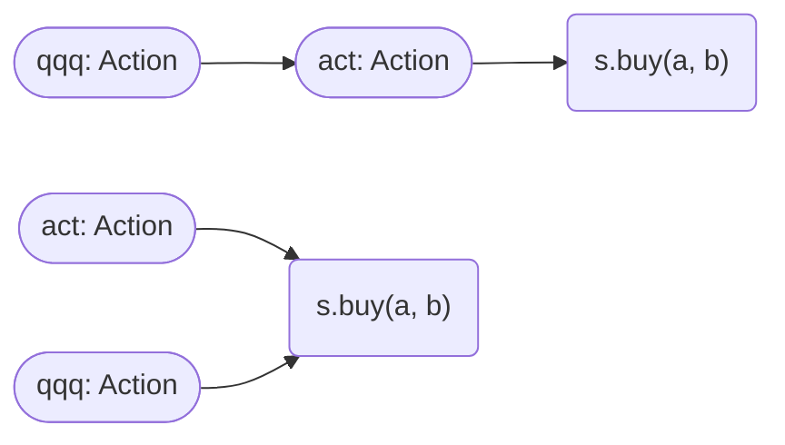
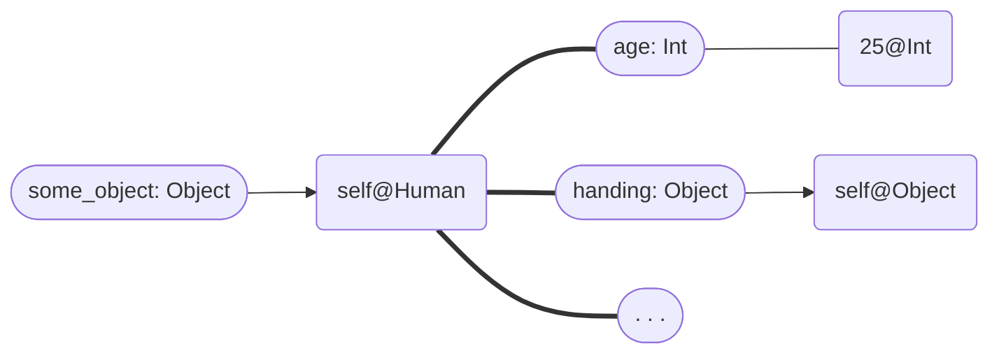
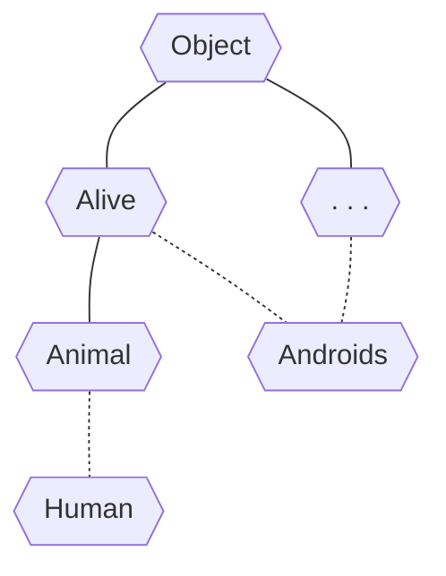

# 序

> 我打算用编程的方式来构造一个生成语法工具。
> ——ChenWuwei404

# 概览 - Outline
## 基本框架 - Framework
**pygic** 是基于 `Python` 面向对象特性而设计的 **逻辑分析** 和 **语法生成** 系统。

基本的研究对象有：
* 数值对象
  * `Int`（整数）
  * `Float`（实数）
  * `Complex`（虚数）
  * `Char`（字符）
  * 逻辑对象
    * `Bool`（布尔，是或否）
* 复合对象
  * `Sequence`（序列）
    * `Str`（字符串）
    * `List`（列表）
    * `Tuple`（元组）
  * `Set`（集合）
    * `Dict`（字典）

> 上述的所有类型都继承自 `Object`。
> 其实就是 `Python` 的基础类型，不过为了统一使用**大写**。

预定义的 pygic 研究对象类型如下：
|OBJECT|obj|||action|system|
|:-----:|:-----:|:-----:|:-----:|:-----:|:-----:|
|**mono**|`Object`|`Attrbute`|`Method`|`Action` `Event`|`Time` `Position`|
|---|||`Function`|`Proposition`|`TimeLast`|
|**set**|`ObjectSet`|||`ActionSet` `EventSet`|`TimeSet` `PositionSet`|
|---|`Class`|||`PropositionSet`|`TimeRange` `Volume`|
> 表格中所有的对象类型都是**对象**（`Object`）的继承。
> 

一切针对客观世界的研究本质上就是对物体（object）的属性（attribute）和属性变化（哲学中称为运动）的研究。而在生成语法理论中，内在性语言的运算系统本质上也是对上面所述的整合。

**pygic** 研究的是 **普遍语法**，即生成语法的核心内容，外延的其他语言系统可以通过扩展包定义不同的语法生成规则。

## 符号约定 - FormPreference
|Form|Type|
|:-:|:-:|
|`XxxXxx`<br/>大驼峰命名法|定义的**类型**（`Class`）的标识符|
|`xxx_xxx`<br/>下划线命名法|定义的**方法**（`Method`）和**函数**（`Function`）的标识符|
|`xxx_xxx: XxxXxx`<br/>下划线和大驼峰|定义的**对象**（`Object`）或**实例**的标识符<br/><span style="color: gray">以及</span><br/>指针或变量的**类型标记**|
|`XXX_XXX`<br/>全大写命名法|定义的**常量**（constant）的标识符|

注意：pygic **不使用** $\phi$、$\theta$、😡 等非 ASCII 字符作为标识符（字符串可以含有 Unicode 字符）。

## 性质 - Features
### 形式化 - Formalization
**pygic** 采用了**大多数** `Python` 的原生语法，并尽可能保证贴合自然语言的语法特征。如
```python
s.buy(a, b)
```
表示 “s buy a b”（s 给 a 买 b）这一**行为**（`Aciton`），而在 `Python` 中将会执行这一指令而不是构造这一行为。其中 `s` 是主语（执行对象），`a` 和 `b` 是两个宾语（参数）。

### 灵活性 - Flexibility
同样对于 
```python
s.buy(a, b)
```
这一 `Action`，在英语中表达为“s buy a b”，但在汉语中则表达为“s 给 a 买 b”，这是语法生成规则集中的不同规定。

**pygic** 支持自定义语法生成规则集来拟合或制造语言。

### 同一性 - Identity
> 对 `Python` 的对象管理了解者可跳过这一小节。

对于同样的逻辑构造，无论使用什么样的标识符，最终所表示的客观逻辑事实和生成所得的语句都是一致的（生成的语句取决于语言生成规则集）。

例如我们令
```python
act: Action = s.buy(a, b)
```
和令
```python
ppp: Action = s.buy(a, b)
```
本质上 `act` 和 `ppp` 都是指“s 给 a 买 b”这一行为，但注意**不是同一个行为对象**，因为每次调用 `s.buy` 是都会重新构造一个 `Action` 对象，只是他们的值完全相同。


> 在**对象关系图**中使用胶囊表示指针，圆角矩形表示对象。

假如我们令
```python
act: Action = s.buy(a, b)
qqq: Action = act
```
则此时可以称 `act` 和 `qqq` 是同一个对象，因为这二者只是标识符，作为指针（pointer）最终指向了同一个对象。



# 逻辑模块 - pygic.logic
## 对象 - Object
**对象**（object）是 **pygic** 的基本研究单元，其本身作为一个整体的同时还兼有一个或多个属性（attribute，也可称为性质）。属性是一个对象的“下设指针”（指向非数值对象的对象时）或“下设变量”（值为数值对象时），是 **pygic** 的研究内容。


> 用**加粗线条**表示右侧的指针变量是左侧对象的属性之一。

### 类型的继承
所有的其他类型都是 `Object` 的**子类**（sub-class)。

**子类**拥有所有其**父类**（又称**超类**，super-class）的属性和方法，同时还可以添加更多研究内容。一个类型可以继承自多个父类型。（如下图，虚线代表省略了不研究的中间类型）



> 在所有需要一个类型（暂记为 `A`）的位置可以填入 `A` 的所有子类（暂记单个类型为 `B`）的对象，但在需要 `B` 的位置不一定能填入 `A` 类型的对象。
> 
> 用集合的方式可以表述为 $B \subset A$，对于所有 $b \in B$，都有 $b \in A$，但 $\exist a \in A$ 且 $a \notin B$。

### 对象形式化研究
一种对象的研究属性在定义这类对象时就已确定。如：
```python
class Animal(Object):
    age: Float
    def eat(food: Eatale) -> None:...
    def excrete() -> Excretion:...
```
定义了具有 `age`（年龄）、`eat`（摄食）、`excrete`（排泄）三个属性的 `Animal` 类，其中 `eat` 和 `excrete` 是其可以执行的方法（method）。

> **pygic** 中用  `class` 关键字来定义一个类型，括号中列出了其继承的父类（可以多个），冒号后的缩进块中**逐行**列出了所有要研究的属性及其类型标注。
> 
> 类的方法用 `def` 关键字在缩进块中定义，括号中列出所有参数，冒号后的二级缩进块中写了这一方法的实际作用。
> 如果直接在冒号后写上 `...` 表示暂不研究其实际作用。

接下来，可以通过
```python
// 接上面的代码片段
animal = Animal(age=1.0)
```
从集合 `Animal` 中选择一个**新的**年龄为 `1.0` 的 `Animal` 对象并将标识符 `animal` 指向这一对象。

不难发现，`eat` 是具有一个参数（`food`）的方法，我们称一个方法构造行为所需要的参数为**需求参数**（requested-parameter），可看做语言中的宾语，这个方法可以看做语言中的动词。

例如
```python
def excrete() -> excretion:...
```
不具有需求参数，可看做不及物动词。

## 行为 - Action
行为是一个包含了**施加者**（主语）、**接受者**（宾语，如果有的话）以及**方法**（动作）的一个类型。`Action` 的定义如下：
```python
class Action:
    subject: Object
    method: Method
    embracer: Union[Object, None]
    product: Object
```

### 行为的形式化表达
假设我们现在有
```python
animal = Animal(age=1.0)
food = Food(energy=1000.0)
```
两个对象，则“`animal` 吃 `food`”这一行为可表达为
```python
animal.eat(food)
```
我们也可以用一个新的标识符来指向这个行为对象以供后续研究：
```python
eat_action = animal.eat(food)
```

## 事件 - Event
**事件**描述了一个行为发生的时间和地点，具有客观性。

### 事件的构造
**pygic** 中可以直接通过调用一个行为对象并给出时间和地点的方式来构造一个事件对象：
```python
eat_event = eat_action(time=0, position=(0, 0, 0))
```

（尚未完成）

# 语言模块 - pygic.structor
（尚未开始）
